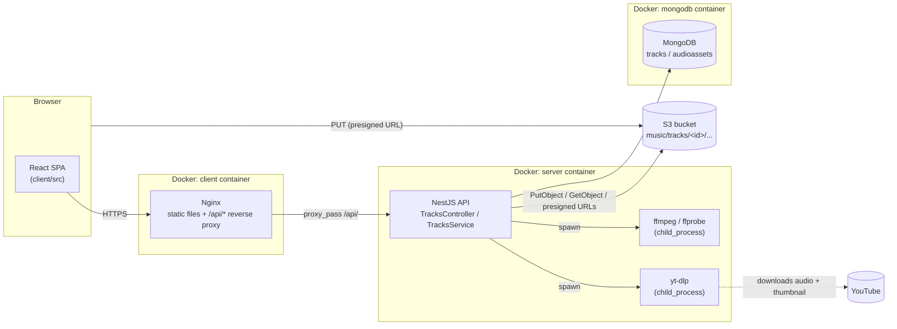
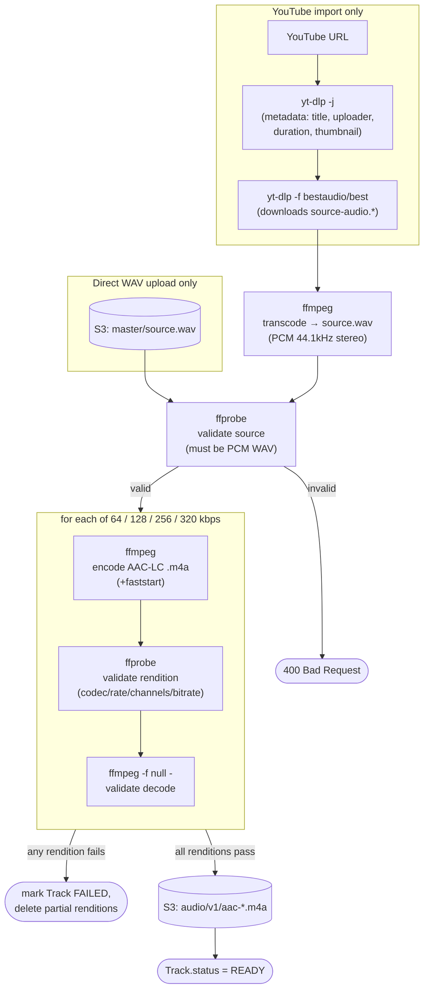
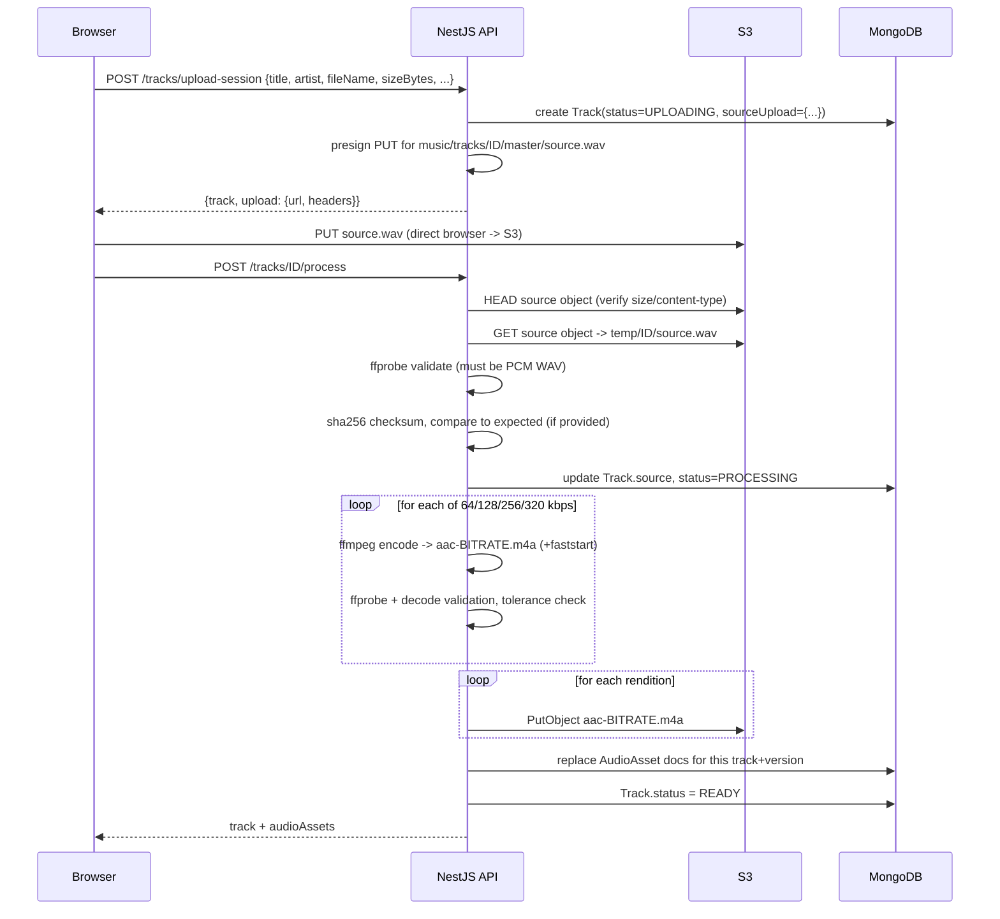
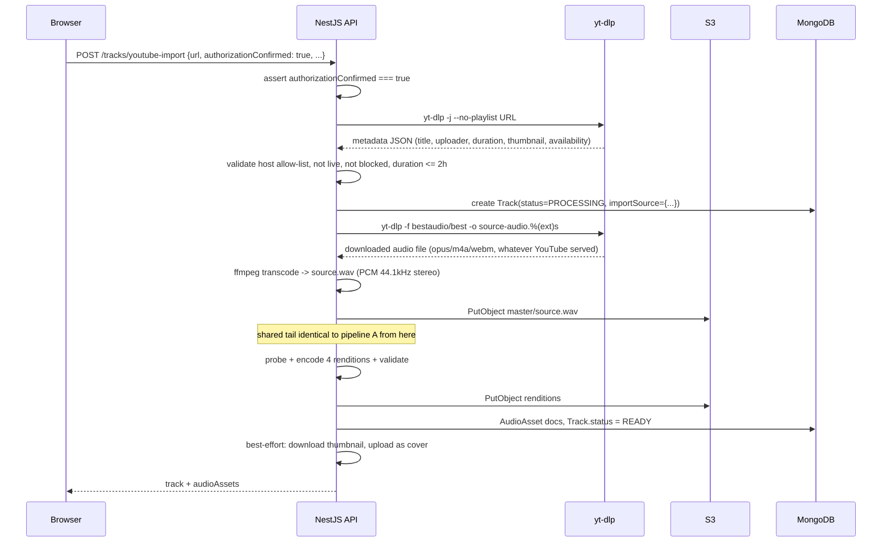
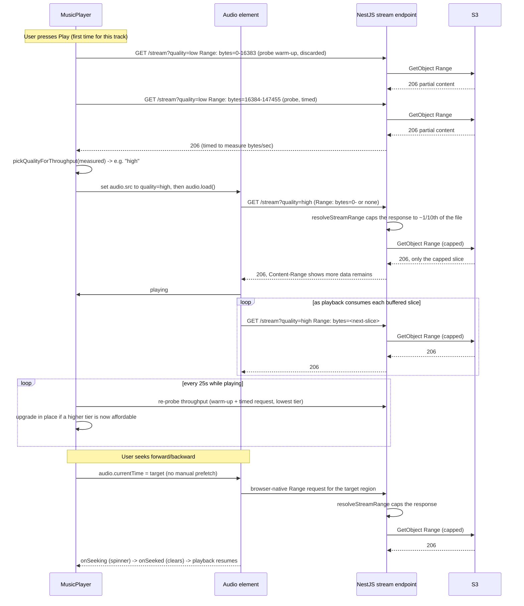

# Architecture — v1

This document describes the system as implemented today: component topology, the two ingestion pipelines (direct upload and YouTube import), the streaming/adaptive-bitrate path, and deployment.

## 1. System overview



Three containers (`docker-compose.yml`): `mongodb`, `server`, `client`. The client container serves the built SPA and reverse-proxies `/api/*` to the server container over the Docker network — the browser never talks to the server directly, which is why no browser-facing CORS configuration is needed between client and server. The server is the only component with S3 and MongoDB credentials.

## 2. Client component tree

```
App.tsx (routes, theme mode)
└── AppShell (layout/AppShell.tsx)
    ├── Navbar (layout/Navbar.tsx)
    ├── Sidebar (layout/Sidebar.tsx)
    ├── <Routes>
    │   ├── HomePage        → RecentBanner + CategoryRow[] → TrackCard[]
    │   ├── BrowsePage      → TrackList
    │   ├── PlaylistsPage
    │   └── UploadPage      → file-upload panel | YouTube-import panel
    ├── MusicPlayer (persistent dock, driven by LibraryContext.activeTrack)
    └── QueueSidebar
```

State is centralized in `LibraryContext` (`client/src/state/LibraryContext.tsx`): it fetches `GET /tracks?status=READY&limit=100` once on mount, exposes `tracks`, `activeTrack`, `playTrack`, and a client-side `searchResults` filter over title/artist/album. There is no server-side routing state beyond React Router; there is no authentication layer.

## 3. Backend module layout

```
AppModule
└── TracksModule
    ├── TracksController        (HTTP layer, 8 routes)
    ├── TracksService           (orchestration, business rules)
    ├── AudioProcessingService  (ffmpeg/ffprobe subprocess wrapper)
    ├── AudioStorageService     (S3 SDK wrapper: put/get/head/delete/presign)
    └── YoutubeImportService    (yt-dlp subprocess wrapper, host allow-list)
```

There is a single feature module (`TracksModule`). Config is centralized via `@nestjs/config` with Joi validation (`env.validation.ts`) so the process fails fast on startup if required variables are missing.

### Routes (`TracksController`)

| Method | Path | Purpose |
|---|---|---|
| `POST` | `/tracks/upload-session` | Create a track (status `UPLOADING`) + presigned S3 PUT URL for a WAV master |
| `POST` | `/tracks/youtube-import` | Create a track from a YouTube URL (full pipeline runs synchronously) |
| `POST` | `/tracks/:id/process` | Trigger transcode of an already-uploaded WAV master |
| `POST` | `/tracks/:id/cover-upload-session` | Presigned S3 PUT URL for a cover image |
| `GET` | `/tracks/:id/cover` | Proxies the cover image bytes from S3 |
| `GET` | `/tracks` | Paginated, filterable track list |
| `GET` | `/tracks/:id/stream` | Byte-range audio streaming (adaptive rendition selection) |
| `GET` | `/tracks/:id` | Single track detail |

All routes are mounted under the global prefix `/api/v1` (configured in `main.ts`).

## 4. External binaries: ffmpeg, ffprobe, and yt-dlp

The server doesn't implement audio decoding, encoding, or YouTube extraction itself — it shells out to three well-established command-line tools, all installed into the `server` Docker image (`server/Dockerfile`) and invoked via Node's `child_process.spawn` with an argument array (never a shell string, so a filename or URL can never be interpreted as a shell command).

| Package | Installed via | Invoked from | Purpose in this app |
|---|---|---|---|
| **ffmpeg** | `apt-get install ffmpeg` | `AudioProcessingService.encodeRendition`, `.transcodeToWav`, `.validateDecode` | The actual audio encoder/transcoder. Converts arbitrary downloaded audio into PCM WAV, and encodes that WAV into the four delivery-quality AAC-LC `.m4a` files. |
| **ffprobe** | Bundled with the `ffmpeg` apt package | `AudioProcessingService.probeAudio` | The read-only inspector half of the ffmpeg project. Never modifies a file — it reports codec, container, duration, sample rate, channels, and bitrate as JSON, which is what both validates uploads and confirms encoded output. |
| **yt-dlp** | `pip3 install yt-dlp` | `YoutubeImportService.fetchMetadata`, `.downloadAudio` | A YouTube (and, in general, many-site) video/audio extractor. Used here only for two things: pulling a video's JSON metadata (title, uploader, duration, thumbnail, availability) and downloading its best available audio track. |

### What each one is actually doing

**ffmpeg** is the encoder. Every audio *transformation* in the app goes through it:
- `transcodeToWav`: whatever container/codec `yt-dlp` downloaded (typically Opus in WebM, or AAC in M4A) → PCM WAV, 44.1kHz stereo — so the YouTube-import pipeline can feed the same shape of file into the rest of the system as a direct WAV upload.
- `encodeRendition`: the canonical WAV master → AAC-LC in an M4A container, once per target bitrate (64/128/256/320 kbps), with `-movflags +faststart` so the file's index metadata sits near the start for fast, seekable progressive playback (see [ADR-0002](adr/0002-multi-bitrate-aac-renditions.md)).
- `validateDecode`: re-decodes a freshly-encoded file to `-f null -` (discarding output) purely to confirm ffmpeg itself can decode what it just produced without error, before it's ever uploaded or served.

**ffprobe** is the inspector — it never writes or changes a file, only reports on one. It's called at three points: once on the incoming source (to reject anything that isn't real PCM WAV, regardless of what its filename or declared MIME type claimed), once per freshly-encoded rendition (to confirm codec, sample rate, channel count, and bitrate all landed within tolerance), and to fill in `Track.source`/`AudioAsset` duration and format fields stored in MongoDB.

**yt-dlp** is the one piece of the pipeline that talks to the outside internet. It never touches ffmpeg's job — it does not transcode anything itself in this app's usage; it only fetches. `fetchMetadata` runs it with `-j --no-playlist` to get a single JSON metadata blob (used for validation — host, live status, availability, duration — and for populating a track's title/artist/import provenance before anything is downloaded). `downloadAudio` runs it with `-f bestaudio/best` to save the best available audio-only stream to disk, in whatever format YouTube happens to serve it — which is exactly what `ffmpeg` then normalizes into WAV.

### How the three work together



yt-dlp only ever appears at the very start of the YouTube pipeline, handing off a raw downloaded file; from that point on — and for every direct WAV upload, which skips yt-dlp entirely — the same ffmpeg/ffprobe validate-encode-validate sequence in `AudioProcessingService` runs identically, which is what lets both ingestion pipelines share the single `encodeUploadAndActivate` method described in section 6 below.

## 5. Ingestion pipeline A — direct WAV upload



The browser never sends audio bytes through the API — only the presigned PUT goes to S3 directly. `/process` is synchronous today (see [ADR-0006](adr/0006-state-based-processing-pipeline.md)); temp files are always cleaned up in a `finally` block, and a failed run marks the track `FAILED`, deletes any partially-uploaded renditions, and leaves the source WAV in S3 for retry.

## 6. Ingestion pipeline B — YouTube import



Only `youtube.com`/`youtu.be` hostnames are accepted (`YoutubeImportService.ALLOWED_HOSTNAMES`), and the caller must explicitly set `authorizationConfirmed: true` — the UI enforces this via a required checkbox. Cover-image import is best-effort: any failure (bad content-type, network error, missing thumbnail) is swallowed and logged, and the client falls back to one of the app's bundled placeholder covers. The rest of the pipeline (probe → encode 4 renditions → upload → activate) is the exact same private method (`encodeUploadAndActivate`) used by the direct-upload flow, so both ingestion paths produce identical `AudioAsset` shapes.

## 7. Streaming and adaptive bitrate

Each track has up to four `READY` `AudioAsset` renditions (64/128/256/320 kbps AAC-LC in M4A, `+faststart`). The client never binds a `<audio>` element's `src` on track selection — only on Play or Seek — so browsing the catalog causes zero network activity ([ADR pending: lazy stream attachment is covered under ADR-0003](adr/0003-client-side-throughput-probing.md)).



Key points:

- **Throughput probing, not `navigator.connection`** — a timed 128 KB ranged fetch against the lowest-bitrate rendition drives the initial quality pick, preceded by a small discarded 16 KB warm-up fetch on the same URL so DNS/TLS/TCP-slow-start setup cost isn't counted as part of the measured throughput (a fast connection with a cold socket previously measured as slow). `navigator.connection.effectiveType` is not trustworthy for this either way: it doesn't reflect Chrome DevTools throttling and isn't implemented in Safari/Firefox. See [ADR-0003](adr/0003-client-side-throughput-probing.md).
- **Server-side capped byte-range chunking** — `TracksService.resolveStreamRange` never serves more than roughly 1/10th of a rendition's total size in one response (clamped between 256 KB and 2 MB), regardless of what the caller's `Range` header asked for. An open-ended `Range: bytes=0-` (or no `Range` header at all) used to make S3 — and this server — hand back the entire remaining file in a single response, which is why a single stream request could transfer several megabytes for a track the listener might stop after a few seconds. Because every response's `Content-Range` shows more data remains, the `<audio>` element naturally issues a fresh `Range` request as it drains each buffered slice, without any client-side timers. See [ADR-0007](adr/0007-server-side-capped-byte-range-chunking.md).
- **In-place quality switching** — `switchToAsset()` swaps `audio.src` to a different rendition, restores `currentTime` once `loadedmetadata` fires, and resumes playback if it was playing. Downgrade triggers after two stalls within 20 seconds; upgrade is checked opportunistically every 25 seconds while playing.
- **Native range-based seeking** — seeking sets `audio.currentTime` directly and lets the browser issue whatever `Range` request it needs, relying on `+faststart` encoding so the media engine can jump to arbitrary offsets without downloading everything before them. See [ADR-0004](adr/0004-native-range-based-seeking.md) and [the forward-seek issue writeup](issues/client-issues.md#infinite-loading-state-on-forward-seek).
- **Caching** — an explicit `quality=<tier>` URL maps deterministically to one immutable file and is served `Cache-Control: private, max-age=604800, immutable`; `quality=auto` is `no-store` because the same URL can resolve to a different file depending on the caller's guessed network profile. Caching applies per capped slice, not per whole file, since that's now all a single response ever contains.
- **Offline handling** — a global `OfflineGuard` overlay blocks the entire app while `navigator.onLine` is false (checked on load, not just via the `offline` event, so a refresh while offline still shows it), clearing only on the `online` event. Within the player itself, `playableSeekTime()` additionally clamps a forward seek to the contiguously-buffered range while offline, and `handleTimeUpdate` pauses playback with a notice once it reaches the edge of what's actually been downloaded.
- A `stream-cache-worker.js` service worker additionally caches the first capped slice of each stream in the Cache Storage API as a complementary, best-effort browser-side cache; it is not required for correctness and passes through to the network for anything it doesn't have cached. Caching now happens via `event.waitUntil()` in the background rather than being awaited inline, so it can no longer delay bytes reaching the `<audio>` element (see [ADR-0007](adr/0007-server-side-capped-byte-range-chunking.md)).

## 8. Data model summary

Two MongoDB collections: `tracks` (catalog metadata + lifecycle status) and `audioassets` (one document per encoded rendition, versioned). See [`DB_SCHEMA.md`](DB_SCHEMA.md) for full field-level detail.

## 9. S3 object layout

```
music/
└── tracks/
    └── <trackId>/
        ├── master/
        │   └── source.wav              # canonical PCM WAV, kept for retries/re-encodes
        ├── audio/
        │   └── v1/
        │       ├── aac-64.m4a
        │       ├── aac-128.m4a
        │       ├── aac-256.m4a
        │       └── aac-320.m4a
        └── cover/
            └── cover.<jpg|png|webp>
```

Delivery assets are namespaced by version (`v1`) so a future change to the encoding strategy can produce `v2` without overwriting or breaking existing `Track.activeAudioVersion` references.

## 10. Deployment topology (Docker Compose)

| Service | Image / build | Exposed port | Notes |
|---|---|---|---|
| `mongodb` | `mongo:7` | `27017` | Named volume `mongo-data` |
| `server` | `server/Dockerfile` (multi-stage Node 20) | `3001` (host) → `3001` (container, `PORT` env) | Installs `ffmpeg`, `ffprobe`, `python3`, and `yt-dlp` via pip in the runner stage |
| `client` | `client/Dockerfile` (Node 20 build → `nginx:1.27-alpine`) | `5173` (host) → `80` (container) | `nginx.conf` proxies `/api/` to `server:3001` with `Range`/`If-Range` header passthrough and `proxy_buffering off` |

`server` depends on `mongodb`; `client` depends on `server`. Client code changes require an explicit rebuild+redeploy of the `client` container — a locally-running Vite dev server on the same host binds a different network path than the Dockerized Nginx build, which is a common source of "my change isn't showing up" confusion during development.
