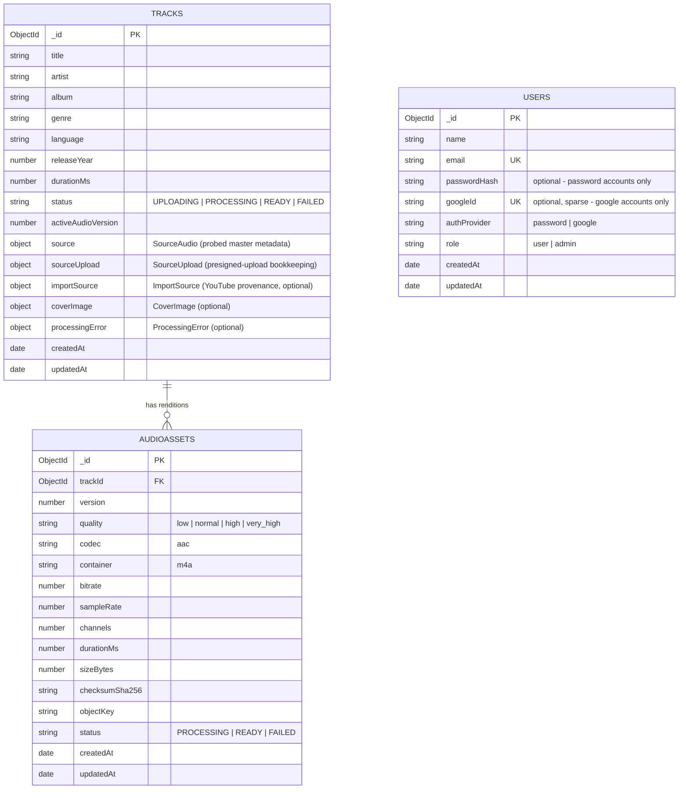

# Database Schema — v1

MongoDB is used purely for searchable catalog metadata and processing state. Audio bytes and images never touch MongoDB — they live in S3, referenced by object key. This keeps documents small and keeps binary data out of database backups.

Database: `music-streaming` (from `MONGODB_URI`). Three collections: `tracks`, `audioassets`, and `users`.

## Entity relationship

`users` has no foreign-key relationship to `tracks`/`audioassets` — there is no per-user ownership or ACL on catalog data today; a JWT's `role` claim alone decides which routes a request may reach (see [`ARCHITECTURE.md`](ARCHITECTURE.md#11-authentication) and [ADR-0008](adr/0008-google-oauth-users-password-admin.md)).



## `tracks` collection

Schema source: `server/src/modules/tracks/schemas/track.schema.ts`. Mongoose `{ timestamps: true, collection: 'tracks' }`.

| Field | Type | Notes |
|---|---|---|
| `title` | `string` (required, trimmed) | Indexed |
| `artist` | `string` (required, trimmed) | Indexed |
| `album` | `string` (trimmed) | Indexed |
| `albumArtist` | `string` (trimmed) | |
| `genre` | `string` (trimmed) | Indexed; drives home-page genre rows |
| `releaseYear` | `number` | |
| `trackNumber` | `number` | |
| `discNumber` | `number` | |
| `composer` | `string` (trimmed) | |
| `copyright` | `string` (trimmed) | |
| `language` | `string` (trimmed) | Free-form tag (e.g. `en`, `hi`, `pa`) — **not** a MongoDB text-search language name; see the `language_override` note below |
| `isrc` | `string` (trimmed) | Validated against the ISRC format at the DTO layer for direct uploads |
| `durationMs` | `number` | Default `0`; set once the source master is probed |
| `status` | `enum TrackStatus` | `UPLOADING` → `PROCESSING` → `READY`, or `FAILED`. Indexed. Default `UPLOADING` |
| `activeAudioVersion` | `number` | Default `1` (`AUDIO_VERSION` constant); which `audioassets.version` is currently servable |
| `source` | `SourceAudio` (embedded, optional) | Probed metadata of the master WAV once processed (see below) |
| `sourceUpload` | `SourceUpload` (embedded, optional) | Bookkeeping for the direct-upload presigned-PUT flow (see below) |
| `importSource` | `ImportSource` (embedded, optional) | Present only for YouTube-imported tracks (see below) |
| `coverImage` | `CoverImage` (embedded, optional) | Present once a cover has been uploaded (direct upload) or imported (YouTube thumbnail) |
| `processingError` | `ProcessingError` (embedded, optional) | Set when `status === FAILED`; cleared (`$unset`) on a successful re-run |
| `createdAt` / `updatedAt` | `Date` | Mongoose timestamps |

### Embedded sub-schemas (all `{ _id: false }`)

**`SourceAudio`** — probed metadata of the canonical master, written once processing succeeds:

```
codec, container, sampleRate, channels, channelLayout?, bitDepth?, bitrate?,
sizeBytes, checksumSha256, objectKey
```

**`SourceUpload`** — set when a direct-upload session is created, describes the pending/completed presigned PUT:

```
objectKey, originalFileName, contentType, expectedSizeBytes,
expectedChecksumSha256?, uploadUrlExpiresAt?
```

**`ImportSource`** — set only for tracks created via `POST /tracks/youtube-import`:

```
provider: 'youtube', sourceUrl, sourceId?, importedTitle?, importedUploader?
```

**`CoverImage`**:

```
objectKey, contentType, sizeBytes
```

**`ProcessingError`**:

```
message?, stage?   // stage is one of the ProcessingStage enum values
```

### Indexes on `tracks`

```js
{ title: 1 }        // via index: true on the field
{ artist: 1 }
{ album: 1 }
{ genre: 1 }
{ status: 1 }
{ title: 'text', artist: 'text', album: 'text', genre: 'text' }  // compound text index
```

The text index is created with `{ language_override: 'textIndexLanguage' }`. This is deliberate: MongoDB's text index otherwise reads each document's *own* `language` field to decide which stemming rules to apply, and this app's `language` field holds a track's spoken/vocal language tag (`hi`, `pa`, `en`, ...), not one of Mongo's recognized text-search language names — inserting a document with an unrecognized value in the field the text index reads for language selection throws `language override unsupported`. Pointing the index at a different (unused) field name sidesteps this entirely. See [`issues/server-issues.md`](issues/server-issues.md#mongodb-language-override-unsupported-on-track-insert) for the incident this fixed.

## `audioassets` collection

Schema source: `server/src/modules/tracks/schemas/audio-asset.schema.ts`. Mongoose `{ timestamps: true, collection: 'audioassets' }`. One document per encoded rendition per track per version.

| Field | Type | Notes |
|---|---|---|
| `trackId` | `ObjectId` (ref `Track`, required) | Indexed |
| `version` | `number` (required) | Currently always `1` (`AUDIO_VERSION`); reserved for future re-encodes without deleting history |
| `quality` | `enum` (required) | `low` (64k) / `normal` (128k) / `high` (256k) / `very_high` (320k) |
| `codec` | `'aac'` (required, default) | |
| `codecProfile` | `'LC'` (required, default) | AAC-LC |
| `container` | `'m4a'` (required, default) | |
| `bitrate` | `number` (required) | In bps (e.g. `64000`); indexed |
| `sampleRate` | `number` (required) | Normalized to 44100 Hz |
| `channels` | `number` (required) | Normalized to 2 (stereo) |
| `channelLayout` | `string` (optional) | From ffprobe |
| `durationMs` | `number` (required) | From ffprobe on the encoded output |
| `sizeBytes` | `number` (required) | |
| `checksumSha256` | `string` (required) | SHA-256 of the encoded file |
| `objectKey` | `string` (required) | S3 key, e.g. `music/tracks/<id>/audio/v1/aac-64.m4a` |
| `status` | `enum AudioAssetStatus` (required, default `PROCESSING`) | `PROCESSING` \| `READY` \| `FAILED` |
| `createdAt` / `updatedAt` | `Date` | Mongoose timestamps |

### Indexes on `audioassets`

```js
{ trackId: 1 }                          // via index: true on the field
{ trackId: 1, version: 1 }
{ trackId: 1, version: 1, bitrate: 1 }, { unique: true }
```

The compound unique index prevents two documents for the same track/version/bitrate from existing simultaneously — `encodeUploadAndActivate` always `deleteMany`s the existing version's assets before `insertMany`-ing the freshly-encoded set, so a re-run of processing can't leave duplicate or orphaned renditions behind.

## `users` collection

Schema source: `server/src/modules/auth/schemas/user.schema.ts`. Mongoose `{ timestamps: true, collection: 'users' }`.

| Field | Type | Notes |
|---|---|---|
| `name` | `string` (required, trimmed) | For Google accounts, taken from the Google profile at first sign-in |
| `email` | `string` (required, trimmed, lowercased, unique) | Indexed. The one identifier shared by both auth methods |
| `passwordHash` | `string` (optional) | Set only for the admin's password account; bcrypt hash, never the plaintext. Absent on Google accounts |
| `googleId` | `string` (optional, sparse unique index) | Google's stable per-account subject (`sub`) claim. Absent on the password account |
| `authProvider` | `enum 'password' \| 'google'` (required) | Which flow this account actually authenticates through; doesn't change if the fields above are present, only which one is authoritative |
| `role` | `enum 'user' \| 'admin'` (required, default `'user'`) | `admin` is set only by `scripts/seed-admin.js`; nothing in the API can set or change it |
| `createdAt` / `updatedAt` | `Date` | Mongoose timestamps |

### Indexes on `users`

```js
{ email: 1 }, { unique: true }
{ googleId: 1 }, { unique: true, sparse: true }
```

The `sparse` option on the `googleId` index is deliberate: without it, MongoDB's unique index would treat every document missing the field (i.e. every password account) as sharing the same implicit `null` value and reject all but the first one. `sparse` excludes documents that don't have the field from the uniqueness check entirely, so any number of password accounts can coexist while still guaranteeing no two Google accounts share a `googleId`.

### Invariants enforced outside the schema

MongoDB has no way to express "at most one document where `role = 'admin'`" as a schema constraint, so it's enforced procedurally instead: `scripts/seed-admin.js` (the only code path that ever sets `role: 'admin'`) reads for an existing admin first and refuses to proceed if one exists under a different email. Nothing in the HTTP API can create, promote, or demote an admin at all — `AuthService.register` was removed for this reason (see [ADR-0008](adr/0008-google-oauth-users-password-admin.md)), and `AuthService.loginWithGoogle` explicitly rejects sign-in attempts whose email already belongs to the admin account rather than allowing the two identities to merge.

## Consistency model

MongoDB and S3 are two independent systems with no shared transaction. The contract the rest of the app relies on is: **a track is only ever considered playable once `Track.status === 'READY'`**, which is only set after every rendition for the active version has been uploaded to S3 *and* recorded in `audioassets`. If any step in `encodeUploadAndActivate` throws, the track is marked `FAILED` with a `processingError`, any renditions already uploaded to S3 for that attempt are deleted, and the original source WAV in S3 is left in place so processing can be retried without re-uploading.
