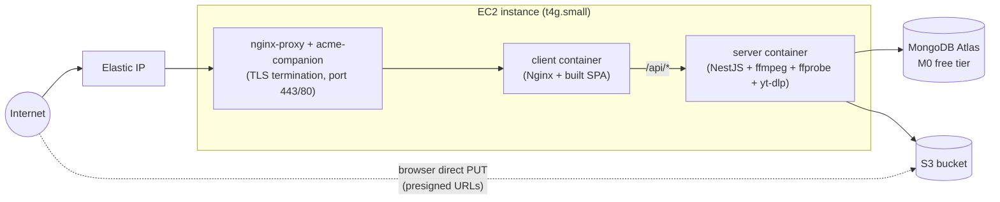

# Deployment Guide — EC2 + Docker Compose + MongoDB Atlas (Recommended)

Step-by-step instructions for the option recommended in [`DEPLOYMENT_OPTIONS.md`](DEPLOYMENT_OPTIONS.md): one EC2 instance running the app's existing Docker Compose stack, MongoDB hosted for free on Atlas, and audio/images in S3. Estimated total cost: **≈ $10–18/month**, running 24/7.

## Overview of what you'll end up with



The `mongodb` service from the repo's `docker-compose.yml` is **not** used in production — it's replaced by an Atlas connection string in `server/.env`. Everything else (the `server` and `client` containers) runs as-is, with one added reverse-proxy layer in front of `client` for TLS.

---

## 1. Prerequisites

- An AWS account
- A domain name you control (recommended, needed for a trusted TLS certificate) — e.g. from Route 53 or any registrar
- A free [MongoDB Atlas](https://www.mongodb.com/cloud/atlas/register) account
- The repo cloned locally, and pushed somewhere the EC2 instance can pull from (GitHub, etc.) — or you'll `scp` it up

---

## 2. Set up MongoDB Atlas (free M0 tier)

1. In the Atlas console, create a new **free (M0) cluster**. Any nearby AWS region is fine — it doesn't need to match your EC2 region, though picking the same region shaves a few ms off latency.
2. **Database Access** → add a database user with a strong generated password (username/password auth is fine for M0).
3. **Network Access** → add an IP access list entry. You won't have your EC2 instance's IP yet, so for now add your current IP to finish setup, or temporarily allow `0.0.0.0/0` — **you will lock this down to just the EC2 instance's Elastic IP in step 5** once it exists. Do not leave it open to the world.
4. **Database** → **Connect** → **Drivers** → copy the connection string. It looks like:
   ```
   mongodb+srv://<user>:<password>@cluster0.xxxxx.mongodb.net/music-streaming?retryWrites=true&w=majority
   ```
   Keep the database name segment (`music-streaming`) matching what the app expects — the app doesn't require a specific name, but pick one and keep it consistent with `MONGODB_URI` in step 6.

---

## 3. Set up the S3 bucket (if you haven't already)

1. Create a **private** S3 bucket (block all public access — the app never serves objects publicly, only via presigned URLs and the API's proxied `/stream`/`/cover` routes).
2. Add a CORS configuration so the browser can `PUT` directly using presigned URLs. Replace the origin with your real domain once you have one (step 7):
   ```json
   [
     {
       "AllowedHeaders": ["*"],
       "AllowedMethods": ["PUT", "GET", "HEAD"],
       "AllowedOrigins": ["https://your-domain.com"],
       "ExposeHeaders": ["ETag", "Accept-Ranges", "Content-Range", "Content-Length"],
       "MaxAgeSeconds": 3000
     }
   ]
   ```
3. Create an IAM user (or role) scoped to only this bucket, with a policy like:
   ```json
   {
     "Version": "2012-10-17",
     "Statement": [
       {
         "Effect": "Allow",
         "Action": ["s3:PutObject", "s3:GetObject", "s3:DeleteObject", "s3:HeadObject"],
         "Resource": "arn:aws:s3:::YOUR-BUCKET-NAME/*"
       }
     ]
   }
   ```
   Generate an access key pair for this user — you'll put these in `server/.env` in step 6.

---

## 4. Launch the EC2 instance

1. **EC2 → Launch instance**
   - **AMI**: Ubuntu Server 22.04 LTS, **arm64** architecture (to match the cheaper Graviton instance type below)
   - **Instance type**: `t4g.small` (2 GiB RAM, 2 vCPU burstable, ARM/Graviton — cheaper than the x86 `t3` equivalent for the same specs)
   - **Key pair**: create or reuse one — you'll need it for SSH
   - **Network settings**: create a security group with:
     - SSH (22) — restrict the source to *your* IP, not `0.0.0.0/0`
     - HTTP (80) — open to `0.0.0.0/0` (needed for Let's Encrypt's HTTP-01 challenge and to redirect to HTTPS)
     - HTTPS (443) — open to `0.0.0.0/0`
   - **Storage**: 20 GiB `gp3` (root volume) is comfortable headroom for the OS, Docker images, and transient transcoding temp files
2. Launch the instance.
3. **Allocate an Elastic IP** (EC2 → Elastic IPs → Allocate) and **associate it** with the new instance. This gives you a stable public IP that survives a stop/start or instance-recovery event, and is what your domain's DNS record will point to.
4. Back in **MongoDB Atlas → Network Access**, replace the temporary IP entry from step 2 with this Elastic IP (as a `/32`), and remove `0.0.0.0/0` if you'd added it.

---

## 5. Point your domain at the instance

In your DNS provider (Route 53 or otherwise), create an **A record** for your domain (e.g. `music.yourdomain.com`) pointing at the Elastic IP from step 4. Wait for propagation (`dig music.yourdomain.com` should return the Elastic IP) before continuing — Let's Encrypt's certificate issuance in step 8 needs this to already resolve correctly.

---

## 6. Install Docker on the instance

SSH in and install Docker Engine + the Compose plugin:

```bash
ssh -i /path/to/your-key.pem ubuntu@<elastic-ip>

curl -fsSL https://get.docker.com | sudo sh
sudo usermod -aG docker $USER
newgrp docker

# Confirm Docker starts automatically on boot (it does by default via systemd)
sudo systemctl enable docker
docker compose version
```

---

## 7. Get the app onto the instance and configure it

```bash
git clone <your-repo-url> sonora
cd sonora

cp server/.env.example server/.env
```

Edit `server/.env` with production values:

```env
PORT=3001
MONGODB_URI=mongodb+srv://<user>:<password>@cluster0.xxxxx.mongodb.net/music-streaming?retryWrites=true&w=majority

AWS_REGION=us-east-1
AWS_S3_BUCKET=your-bucket-name
AWS_ACCESS_KEY_ID=your-access-key-id
AWS_SECRET_ACCESS_KEY=your-secret-access-key
AWS_REQUIRE_EXPLICIT_CREDENTIALS=true

FFMPEG_PATH=ffmpeg
FFPROBE_PATH=ffprobe
YT_DLP_PATH=yt-dlp
MAX_UPLOAD_SIZE_MB=500
CLIENT_ORIGIN=https://music.yourdomain.com
```

---

## 8. Add a TLS-terminating reverse proxy in front of the client container

The repo's `client/nginx.conf` serves plain HTTP on port 80 only — fine for local Docker Compose, not fine for a public production deployment. The simplest way to add automatic, auto-renewing TLS without hand-rolling Certbot is [`nginx-proxy`](https://github.com/nginx-proxy/nginx-proxy) paired with its [`acme-companion`](https://github.com/nginx-proxy/acme-companion): they watch for containers with a `VIRTUAL_HOST` label, issue/renew Let's Encrypt certificates for them automatically, and route by hostname.

Create `docker-compose.prod.yml` in the repo root (kept separate from the base file so local dev is untouched):

```yaml
services:
  server:
    build:
      context: ./server
    restart: unless-stopped
    env_file:
      - ./server/.env
    environment:
      PORT: 3001
    # No host port published — only the client/nginx-proxy layer is public.
    expose:
      - "3001"

  client:
    build:
      context: ./client
      args:
        VITE_API_BASE_URL: /api/v1
    restart: unless-stopped
    depends_on:
      - server
    expose:
      - "80"
    environment:
      VIRTUAL_HOST: music.yourdomain.com
      LETSENCRYPT_HOST: music.yourdomain.com
      LETSENCRYPT_EMAIL: you@yourdomain.com

  nginx-proxy:
    image: nginxproxy/nginx-proxy:1
    restart: unless-stopped
    ports:
      - "80:80"
      - "443:443"
    volumes:
      - /var/run/docker.sock:/tmp/docker.sock:ro
      - certs:/etc/nginx/certs
      - vhost:/etc/nginx/vhost.d
      - html:/usr/share/nginx/html

  acme-companion:
    image: nginxproxy/acme-companion:latest
    restart: unless-stopped
    depends_on:
      - nginx-proxy
    volumes:
      - /var/run/docker.sock:/var/run/docker.sock:ro
      - certs:/etc/nginx/certs
      - vhost:/etc/nginx/vhost.d
      - html:/usr/share/nginx/html
      - acme:/etc/acme.sh

volumes:
  certs:
  vhost:
  html:
  acme:
```

Note there is deliberately **no `mongodb` service** here — the server connects to Atlas via `MONGODB_URI` instead.

Replace `music.yourdomain.com` and `you@yourdomain.com` with your real domain and an email address you control (Let's Encrypt uses it for expiry notices).

---

## 9. Build and start everything

```bash
docker compose -f docker-compose.prod.yml build
docker compose -f docker-compose.prod.yml up -d
```

Watch the logs the first time to confirm certificate issuance succeeds (this can take up to a minute or two):

```bash
docker compose -f docker-compose.prod.yml logs -f acme-companion
```

Once you see it obtained a certificate for your domain, verify:

```bash
curl -I https://music.yourdomain.com/
curl "https://music.yourdomain.com/api/v1/tracks?limit=1"
```

Then open `https://music.yourdomain.com` in a browser and confirm the app loads, and that uploading or streaming a track works end to end.

---

## 10. Make it resilient to reboots and host failures

- **Reboots**: Docker's daemon is already enabled on boot (step 6), and every service in `docker-compose.prod.yml` has `restart: unless-stopped`, so a reboot of the instance brings the whole stack back up unattended.
- **Underlying hardware failure**: create a CloudWatch alarm on the instance's `StatusCheckFailed_System` metric with an **EC2 Auto Recover** action. This automatically migrates the instance to new underlying hardware (keeping the same instance ID, EBS volumes, and — since it's an Elastic IP — the same public IP) if AWS detects a hardware problem, without you needing a second instance or a load balancer.
  ```bash
  aws cloudwatch put-metric-alarm \
    --alarm-name sonora-instance-recovery \
    --namespace AWS/EC2 \
    --metric-name StatusCheckFailed_System \
    --statistic Maximum \
    --period 60 \
    --evaluation-periods 2 \
    --threshold 0 \
    --comparison-operator GreaterThanThreshold \
    --dimensions Name=InstanceId,Value=<your-instance-id> \
    --alarm-actions arn:aws:automate:<region>:ec2:recover
  ```
- **Application-level crash**: covered by `restart: unless-stopped` per-container already.
- This setup is still a single instance — there is no automatic failover to a *different* instance if the whole box needs replacing for a reason recovery can't fix (e.g. you need to resize it). At this app's scale and budget, that tradeoff is what keeps cost minimal; revisit if uptime requirements tighten (see [`DEPLOYMENT_OPTIONS.md`](DEPLOYMENT_OPTIONS.md) for what a higher-availability setup would cost).

---

## 11. Ongoing operations

**Deploying a code change:**

```bash
cd sonora
git pull
docker compose -f docker-compose.prod.yml build
docker compose -f docker-compose.prod.yml up -d
```

**Viewing logs:**

```bash
docker compose -f docker-compose.prod.yml logs -f server
docker compose -f docker-compose.prod.yml logs -f client
```

**Backups:**
- MongoDB data lives in Atlas, which handles backups for you (even on the M0 free tier, Atlas retains a basic snapshot).
- Audio/cover data lives in S3 — enable [S3 Versioning](https://docs.aws.amazon.com/AmazonS3/latest/userguide/Versioning.html) on the bucket if you want protection against accidental overwrite/delete; it costs a little extra storage for retained versions but nothing if you never overwrite objects (this app never does — object keys are content-addressed by track ID and version).
- The EC2 instance itself is stateless application code plus Docker images — nothing on it needs backing up beyond your Git repository and `server/.env` (keep a copy of `.env` somewhere safe, e.g. a password manager or AWS Secrets Manager — it is deliberately not committed to Git).

**Monitoring:**
- Basic CPU/network/disk metrics are available for free in the EC2 console under **Monitoring**.
- For a closer eye on the app itself, `docker compose -f docker-compose.prod.yml logs` is the fastest path at this scale; shipping logs to CloudWatch Logs is a reasonable next step if you outgrow SSH-and-`docker logs`.

**Security housekeeping:**
- Keep the OS patched: `sudo apt update && sudo apt upgrade` periodically (or enable unattended-upgrades).
- Rotate the IAM access key used in `server/.env` periodically.
- If you stop needing direct SSH access day-to-day, consider switching to [AWS Systems Manager Session Manager](https://docs.aws.amazon.com/systems-manager/latest/userguide/session-manager.html) and closing port 22 in the security group entirely.

---

## Cost recap

See [`DEPLOYMENT_OPTIONS.md`](DEPLOYMENT_OPTIONS.md#estimated-monthly-cost-recommended-setup) for the full breakdown — this setup runs **≈ $10–18/month** all-in (EC2 instance + EBS volume + S3 + optional domain), with MongoDB hosting itself costing $0 on Atlas's free tier.
