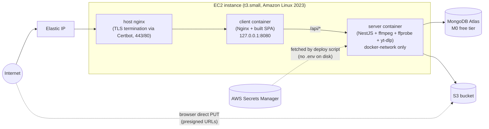

# Deployment Guide — EC2 + Docker Compose + MongoDB Atlas + Secrets Manager (Recommended)

Step-by-step instructions for the option recommended in [`DEPLOYMENT_OPTIONS.md`](DEPLOYMENT_OPTIONS.md): one EC2 instance running the app's Docker Compose stack, MongoDB hosted for free on Atlas, audio/images in S3, and all runtime configuration pulled from AWS Secrets Manager at deploy time — no `.env` file ever touches the instance's disk. Estimated total cost: **≈ $15–22/month**, running 24/7 (see [cost recap](#cost-recap)).

## Overview of what you'll end up with



The `mongodb` service from the repo's `docker-compose.yml` is **not** used in production — it's replaced by an Atlas connection string, delivered via Secrets Manager. The EC2 instance's IAM role grants it read access to S3 and to one Secrets Manager secret — no static AWS access keys anywhere.

---

## 1. Prerequisites

- An AWS account
- A domain name you control (recommended, needed for a trusted TLS certificate) — DNS can be hosted anywhere (Route 53, Cloudflare, Netlify, your registrar, etc.)
- A free [MongoDB Atlas](https://www.mongodb.com/cloud/atlas/register) account
- The repo pushed somewhere the EC2 instance can `git clone` from (a public GitHub repo needs no credentials on the instance; a private repo needs a read-only [deploy key](https://docs.github.com/en/authentication/connecting-to-github-with-ssh/managing-deploy-keys))

---

## 2. Set up MongoDB Atlas (free M0 tier)

1. In the Atlas console, create a new **free (M0) cluster**. Any nearby AWS region is fine — it doesn't need to match your EC2 region, though picking the same region shaves a few ms off latency.
2. **Database Access** → add a database user with a strong generated password (username/password auth is fine for M0).
3. **Network Access** → add an IP access list entry. You won't have your EC2 instance's IP yet, so for now add your current IP to finish setup, or temporarily allow `0.0.0.0/0` — **you will lock this down to just the EC2 instance's Elastic IP in step 4** once it exists. Do not leave it open to the world.
4. **Database** → **Connect** → **Drivers** → copy the connection string. It looks like:
   ```
   mongodb+srv://<user>:<password>@cluster0.xxxxx.mongodb.net/music-streaming?retryWrites=true&w=majority
   ```
   Keep the database name segment (`music-streaming`) matching what you'll put in the Secrets Manager secret in step 7.

---

## 3. Set up the S3 bucket (if you haven't already)

1. Create a **private** S3 bucket (block all public access — the app never serves objects publicly, only via presigned URLs and the API's proxied `/stream`/`/cover` routes).
2. Add a CORS configuration so the browser can `PUT` directly using presigned URLs. Replace the origin with your real domain once you have one:
   ```json
   [
     {
       "AllowedHeaders": ["*"],
       "AllowedMethods": ["PUT", "GET", "HEAD"],
       "AllowedOrigins": ["https://your-domain.com"],
       "ExposeHeaders": ["ETag", "Accept-Ranges", "Content-Range", "Content-Length"],
       "MaxAgeSeconds": 3000
     }
   ]
   ```

No IAM user or access keys are created here — S3 access is granted to the EC2 instance's IAM role in step 5 instead.

---

## 4. Launch the EC2 instance

1. **EC2 → Launch instance**
   - **AMI**: Amazon Linux 2023
   - **Instance type**: `t3.small` (2 GiB RAM, 2 vCPU burstable) minimum. **Don't use `t3.micro`** — building both Docker images (`npm ci` + `tsc` for the server, `npm ci` + Vite bundling for the client, plus `apt-get install ffmpeg`/`pip install yt-dlp` in the server image) is memory-hungry enough that a 1 GiB instance can thrash on swap or stall for a very long time during `docker compose build`. This instance also runs `ffmpeg` transcoding at runtime, which benefits from the same headroom.
     - Want to save a bit more? A Graviton `t4g.small` (arm64) is typically cheaper than `t3.small` for the same specs and works with every command in this guide — just pick an arm64 AMI; the Docker/Compose/Buildx install commands below already detect architecture automatically via `uname -m`.
   - **Key pair**: create or reuse one — you'll need it for SSH
   - **Network settings**: create a security group with:
     - SSH (22) — restrict the source to *your* IP, not `0.0.0.0/0`
     - HTTP (80) — open to `0.0.0.0/0` (needed for Let's Encrypt's HTTP-01 challenge and to redirect to HTTPS)
     - HTTPS (443) — open to `0.0.0.0/0`
     - Nothing else public — the server container (port 3001) and client container (bound to `127.0.0.1:8080` in step 10) are never exposed directly to the internet
   - **Storage**: 20 GiB `gp3` (root volume) is comfortable headroom for the OS, Docker images, and transient transcoding temp files
2. Launch the instance.
3. **Allocate an Elastic IP** (EC2 → Elastic IPs → Allocate) and **associate it** with the new instance. This gives you a stable public IP that survives a stop/start or instance-recovery event, and is what your domain's DNS record will point to.
4. Back in **MongoDB Atlas → Network Access**, replace the temporary IP entry from step 2 with this Elastic IP (as a `/32`), and remove `0.0.0.0/0` if you'd added it.

---

## 5. Create an IAM role for the instance (S3 + Secrets Manager access)

No static AWS credentials are used anywhere in this setup — the app picks up permissions automatically from the instance's IAM role via the AWS SDK's default credential chain.

**5a. Create the policy** — **IAM Console → Policies → Create policy → JSON**:

```json
{
  "Version": "2012-10-17",
  "Statement": [
    {
      "Sid": "S3ObjectAccess",
      "Effect": "Allow",
      "Action": ["s3:GetObject", "s3:PutObject", "s3:DeleteObject"],
      "Resource": "arn:aws:s3:::YOUR-BUCKET-NAME/*"
    },
    {
      "Sid": "SecretsManagerRead",
      "Effect": "Allow",
      "Action": "secretsmanager:GetSecretValue",
      "Resource": "arn:aws:secretsmanager:YOUR-REGION:*:secret:YOUR-SECRET-NAME-*"
    }
  ]
}
```

Replace `YOUR-BUCKET-NAME`, `YOUR-REGION`, and `YOUR-SECRET-NAME` (the secret name you'll use in step 7 — the `-*` suffix accounts for the random characters Secrets Manager appends to every secret's ARN). Name the policy something like `music-streaming-ec2-policy`.

**5b. Create the role** — **IAM Console → Roles → Create role** → trusted entity **AWS service** → use case **EC2** → attach the policy above → name it e.g. `music-streaming-ec2-role`.

**5c. Attach it to the instance** — **EC2 Console → Instances** → select your instance → **Actions → Security → Modify IAM role** → select the role → **Update IAM role**. Takes effect within a minute, no reboot needed.

---

## 6. Install Docker, Compose, and Buildx on the instance

SSH in:

```bash
ssh -i /path/to/your-key.pem ec2-user@<elastic-ip>
```

Amazon Linux 2023's package manager (`dnf`) installs the Docker engine, but **not** the Compose or Buildx CLI plugins — both need a manual install:

```bash
sudo dnf update -y
sudo dnf install -y docker git
sudo systemctl enable --now docker
sudo usermod -aG docker ec2-user
```

Log out and back in for the group change to take effect:

```bash
exit
# ssh back in
```

Install the Compose plugin:

```bash
DOCKER_CONFIG=/usr/local/lib/docker
sudo mkdir -p $DOCKER_CONFIG/cli-plugins
sudo curl -SL "https://github.com/docker/compose/releases/latest/download/docker-compose-linux-$(uname -m)" \
  -o $DOCKER_CONFIG/cli-plugins/docker-compose
sudo chmod +x $DOCKER_CONFIG/cli-plugins/docker-compose
```

Install the Buildx plugin — **required**: `docker compose build`/`up --build` fails outright with `compose build requires buildx 0.17.0 or later` if this is missing or too old, and AL2023 doesn't ship a recent enough version by default:

```bash
ARCH=$(uname -m); case "$ARCH" in x86_64) ARCH=amd64 ;; aarch64) ARCH=arm64 ;; esac
LATEST=$(curl -fsSL https://api.github.com/repos/docker/buildx/releases/latest \
  | grep -oE '"tag_name": *"v[0-9.]+"' | grep -oE 'v[0-9.]+')
sudo curl -SL "https://github.com/docker/buildx/releases/download/${LATEST}/buildx-${LATEST}.linux-${ARCH}" \
  -o $DOCKER_CONFIG/cli-plugins/docker-buildx
sudo chmod +x $DOCKER_CONFIG/cli-plugins/docker-buildx
```

Verify everything:

```bash
docker --version
docker compose version
docker buildx version
docker ps    # should print an empty table with no permission error
```

---

## 7. Create the Secrets Manager secret

**Console → Secrets Manager → Store a new secret → Other type of secret → Key/value pairs.** No `.env` file is ever created on the instance — the deploy script (step 10) fetches this secret fresh on every deploy and exports its values as environment variables for that one `docker compose` invocation only.

| Key | Value |
|---|---|
| `MONGODB_URI` | your MongoDB Atlas connection string (`mongodb+srv://...`) |
| `AWS_REGION` | your region, e.g. `ap-south-1` |
| `AWS_S3_BUCKET` | your bucket name |
| `JWT_SECRET` | generate with `node -e "console.log(require('crypto').randomBytes(48).toString('base64'))"` |
| `JWT_EXPIRES_IN` | `7d` |
| `GOOGLE_CLIENT_ID` | your Google OAuth Web client ID |
| `VITE_GOOGLE_CLIENT_ID` | same value as `GOOGLE_CLIENT_ID` — the client needs it too, baked in at build time |
| `CLIENT_ORIGIN` | `http://<your-elastic-ip>` for now — **you must come back and change this to `https://your-domain.com` in step 12**, or the browser will silently block every API call with a CORS mismatch once the domain is live |
| `MAX_UPLOAD_SIZE_MB` | `500` |

No `AWS_ACCESS_KEY_ID`/`AWS_SECRET_ACCESS_KEY` — the instance role from step 5 covers S3 access.

Name the secret to match what you put in the IAM policy resource ARN in step 5a, e.g. `music-streaming/prod`.

---

## 8. Point your domain at the instance

In your DNS provider, create an **A record** for your domain (e.g. `music.yourdomain.com`) pointing at the Elastic IP from step 4. Wait for propagation before continuing:

```bash
dig +short music.yourdomain.com A
```

Should return the Elastic IP.

---

## 9. Get the app onto the instance

```bash
cd ~
git clone https://github.com/YOUR_ORG/YOUR_REPO.git
cd YOUR_REPO
```

---

## 10. Deploy with `docker-compose.prod.yml` + `scripts/deploy-ec2.sh`

`docker-compose.prod.yml` (repo root, kept separate so local dev's `docker-compose.yml` is untouched) takes every runtime value from shell environment variables rather than a file, and fails loudly (`:?...`) if a required one is missing:

```yaml
services:
  server:
    build:
      context: ./server
    restart: unless-stopped
    environment:
      PORT: 3001
      MONGODB_URI: ${MONGODB_URI:?MONGODB_URI is required}
      AWS_REGION: ${AWS_REGION:?AWS_REGION is required}
      AWS_S3_BUCKET: ${AWS_S3_BUCKET:?AWS_S3_BUCKET is required}
      AWS_REQUIRE_EXPLICIT_CREDENTIALS: "false"
      FFMPEG_PATH: ffmpeg
      FFPROBE_PATH: ffprobe
      MAX_UPLOAD_SIZE_MB: ${MAX_UPLOAD_SIZE_MB:-500}
      CLIENT_ORIGIN: ${CLIENT_ORIGIN:?CLIENT_ORIGIN is required}
      JWT_SECRET: ${JWT_SECRET:?JWT_SECRET is required}
      JWT_EXPIRES_IN: ${JWT_EXPIRES_IN:-7d}
      GOOGLE_CLIENT_ID: ${GOOGLE_CLIENT_ID:?GOOGLE_CLIENT_ID is required}

  client:
    build:
      context: ./client
      args:
        VITE_API_BASE_URL: /api/v1
        VITE_GOOGLE_CLIENT_ID: ${VITE_GOOGLE_CLIENT_ID:?VITE_GOOGLE_CLIENT_ID is required}
    restart: unless-stopped
    depends_on:
      - server
    ports:
      - "127.0.0.1:8080:80"
```

Note `client` binds only to `127.0.0.1:8080` — it's deliberately not reachable from outside the instance. Host nginx (step 11) is the only thing exposed on 80/443, and proxies to it.

`scripts/deploy-ec2.sh` fetches the secret, exports its values for the current process, wipes any stale `.env` file, and brings the stack up:

```bash
#!/usr/bin/env bash
set -euo pipefail

APP_DIR="${APP_DIR:-$(cd "$(dirname "${BASH_SOURCE[0]}")/.." && pwd)}"
AWS_REGION="${AWS_REGION:-ap-south-1}"
SECRET_ID="${SECRET_ID:-music-streaming/prod}"

cd "$APP_DIR"

if ! command -v jq >/dev/null 2>&1; then
  sudo dnf install -y jq
fi

SECRET_JSON="$(aws secretsmanager get-secret-value \
  --region "$AWS_REGION" \
  --secret-id "$SECRET_ID" \
  --query SecretString \
  --output text)"

export MONGODB_URI="$(echo "$SECRET_JSON" | jq -r '.MONGODB_URI // ""')"
export AWS_REGION="$(echo "$SECRET_JSON" | jq -r --arg fallback "$AWS_REGION" '.AWS_REGION // $fallback')"
export AWS_S3_BUCKET="$(echo "$SECRET_JSON" | jq -r '.AWS_S3_BUCKET // ""')"
export JWT_SECRET="$(echo "$SECRET_JSON" | jq -r '.JWT_SECRET // ""')"
export JWT_EXPIRES_IN="$(echo "$SECRET_JSON" | jq -r '.JWT_EXPIRES_IN // "7d"')"
export GOOGLE_CLIENT_ID="$(echo "$SECRET_JSON" | jq -r '.GOOGLE_CLIENT_ID // ""')"
export VITE_GOOGLE_CLIENT_ID="$(echo "$SECRET_JSON" | jq -r '.VITE_GOOGLE_CLIENT_ID // ""')"
export CLIENT_ORIGIN="$(echo "$SECRET_JSON" | jq -r '.CLIENT_ORIGIN // ""')"
export MAX_UPLOAD_SIZE_MB="$(echo "$SECRET_JSON" | jq -r '.MAX_UPLOAD_SIZE_MB // "500"')"

for required_var in MONGODB_URI AWS_REGION AWS_S3_BUCKET JWT_SECRET GOOGLE_CLIENT_ID VITE_GOOGLE_CLIENT_ID CLIENT_ORIGIN; do
  if [ -z "${!required_var}" ]; then
    echo "Missing required deployment value: $required_var"
    exit 1
  fi
done

rm -f server/.env .env

docker compose -f docker-compose.prod.yml up --build -d
docker compose -f docker-compose.prod.yml ps

for attempt in {1..30}; do
  if curl -fsS http://127.0.0.1:8080/api/v1/tracks >/dev/null; then
    echo "Music Streaming App deployment healthy"
    exit 0
  fi
  echo "Waiting for app health check... ($attempt/30)"
  sleep 3
done

echo "Deployment failed health check"
docker compose -f docker-compose.prod.yml logs --tail=120 server
exit 1
```

Both files are already committed to the repo. Run the deploy:

```bash
AWS_REGION=ap-south-1 SECRET_ID=music-streaming/prod ./scripts/deploy-ec2.sh
```

First run takes a few minutes (full image builds, including `ffmpeg`/`yt-dlp` install). It should end with `Music Streaming App deployment healthy`.

---

## 11. Add TLS with host nginx + Certbot

Since `client`'s own nginx is now bound to `127.0.0.1:8080` only, a host-level nginx handles TLS termination and is the sole public listener on 80/443.

**11a. Install and configure nginx:**

```bash
sudo dnf install -y nginx

sudo tee /etc/nginx/conf.d/app.conf > /dev/null <<'EOF'
server {
    listen 80;
    server_name music.yourdomain.com;

    location / {
        proxy_pass http://127.0.0.1:8080;
        proxy_http_version 1.1;
        proxy_set_header Host $host;
        proxy_set_header X-Real-IP $remote_addr;
        proxy_set_header X-Forwarded-For $proxy_add_x_forwarded_for;
        proxy_set_header X-Forwarded-Proto $scheme;
        proxy_set_header Range $http_range;
        proxy_set_header If-Range $http_if_range;
        proxy_buffering off;
    }
}
EOF

sudo nginx -t
sudo systemctl enable --now nginx
```

Verify plain HTTP works through the domain before adding TLS:

```bash
curl -I http://music.yourdomain.com   # expect 200
```

**11b. Install Certbot.** Amazon Linux 2023 has no Certbot package in `dnf` (unlike Ubuntu/Debian) — install it in an isolated venv, the method EFF recommends for Amazon Linux:

```bash
sudo dnf install -y python3 python3-pip augeas-libs
sudo python3 -m venv /opt/certbot/
sudo /opt/certbot/bin/pip install --upgrade pip
sudo /opt/certbot/bin/pip install certbot certbot-nginx
sudo ln -s /opt/certbot/bin/certbot /usr/bin/certbot
```

**11c. Issue the certificate:**

```bash
sudo certbot --nginx -d music.yourdomain.com --redirect -m you@yourdomain.com --agree-tos
```

`--redirect` adds an automatic HTTP→HTTPS redirect to the nginx config. Certbot wires up the `443` server block and reloads nginx itself.

**11d. Set up renewal.** Unlike the OS-packaged version, pip-installed Certbot does **not** configure automatic renewal — add a systemd timer:

```bash
sudo tee /etc/systemd/system/certbot-renew.service > /dev/null <<'EOF'
[Unit]
Description=Certbot Renewal

[Service]
Type=oneshot
ExecStart=/opt/certbot/bin/certbot renew --quiet --deploy-hook "systemctl reload nginx"
EOF

sudo tee /etc/systemd/system/certbot-renew.timer > /dev/null <<'EOF'
[Unit]
Description=Run certbot renew twice daily

[Timer]
OnCalendar=*-*-* 00,12:00:00
RandomizedDelaySec=3600
Persistent=true

[Install]
WantedBy=timers.target
EOF

sudo systemctl enable --now certbot-renew.timer
```

Verify:

```bash
curl -I https://music.yourdomain.com          # 200
curl -I http://music.yourdomain.com           # 301 to https
```

---

## 12. Update `CLIENT_ORIGIN` and redeploy — do not skip this

The secret's `CLIENT_ORIGIN` is still the bare-IP value from step 7. Update it now:

1. **Secrets Manager → your secret → Edit** → change `CLIENT_ORIGIN` to `https://music.yourdomain.com` (no trailing slash) → Save
2. Redeploy so the server picks it up:
   ```bash
   AWS_REGION=ap-south-1 SECRET_ID=music-streaming/prod ./scripts/deploy-ec2.sh
   ```

**Why this matters, and how to recognize it if you skip it:** the browser enforces CORS client-side only — `curl` will happily return `200` for every endpoint regardless of `CLIENT_ORIGIN`, so a server that's silently misconfigured *looks* healthy from the command line. In the browser, though, the page's HTML/JS/CSS still load fine, but every `fetch` to the API gets silently blocked by CORS — so the SPA just spins/loads forever with no visible error. If you ever see that symptom, check the `Access-Control-Allow-Origin` response header (`curl -i .../api/v1/tracks`) against the origin the browser is actually using.

---

## 13. Update the Google OAuth authorized origin

In [Google Cloud Console](https://console.cloud.google.com/) → APIs & Services → Credentials → your OAuth Client ID, add `https://music.yourdomain.com` as an authorized JavaScript origin.

**Google rejects bare IP addresses outright** — `http://<elastic-ip>` was never going to work for "Continue with Google," even before TLS was set up, with no server-side workaround. This is independent of the CORS issue in step 12 — you need both fixed before Google sign-in works. Password-based admin login (step 14) is unaffected either way.

---

## 14. Seed the admin account and verify end to end

Create the one admin account directly against the running `server` container — it already has `MONGODB_URI` etc. from the deploy, no `.env` needed (both arguments are required, and re-running this later with the same email rotates its password rather than creating a second admin — see [ADR-0008](../adr/0008-google-oauth-users-password-admin.md)):

```bash
docker compose -f docker-compose.prod.yml exec server node scripts/seed-admin.js <your-email> <a-strong-password>
```

Open `https://music.yourdomain.com` in a browser:

1. The page loads (not blank, not stuck spinning)
2. Sign in as that admin from `/login` (the "Sign in as admin instead" link) — confirms the Upload nav item appears
3. Confirm "Continue with Google" works once step 13 is done — everyone else signs in this way
4. Try an upload or stream end to end

---

## 15. Make it resilient to reboots and host failures

- **Reboots**: Docker's daemon is enabled on boot (step 6), nginx and the Certbot renewal timer are both `systemctl enable`d (steps 11a/11d), and every service in `docker-compose.prod.yml` has `restart: unless-stopped` — a reboot brings the whole stack back up unattended. (Container restart policy is baked in at container-creation time; it doesn't depend on the shell session that ran the deploy script still being open.)
- **Underlying hardware failure**: create a CloudWatch alarm on the instance's `StatusCheckFailed_System` metric with an **EC2 Auto Recover** action. This automatically migrates the instance to new underlying hardware (keeping the same instance ID, EBS volumes, and — since it's an Elastic IP — the same public IP) if AWS detects a hardware problem:
  ```bash
  aws cloudwatch put-metric-alarm \
    --alarm-name music-streaming-instance-recovery \
    --namespace AWS/EC2 \
    --metric-name StatusCheckFailed_System \
    --statistic Maximum \
    --period 60 \
    --evaluation-periods 2 \
    --threshold 0 \
    --comparison-operator GreaterThanThreshold \
    --dimensions Name=InstanceId,Value=<your-instance-id> \
    --alarm-actions arn:aws:automate:<region>:ec2:recover
  ```
- **Application-level crash**: covered by `restart: unless-stopped` per-container already.
- This setup is still a single instance — there is no automatic failover to a *different* instance if the whole box needs replacing for a reason recovery can't fix (e.g. you need to resize it, as this guide's own testing did — see step 4's `t3.micro` warning). At this app's scale and budget, that tradeoff is what keeps cost minimal; revisit if uptime requirements tighten (see [`DEPLOYMENT_OPTIONS.md`](DEPLOYMENT_OPTIONS.md)).

---

## 16. Ongoing operations

**Deploying a code change:**

```bash
cd YOUR_REPO
git pull
AWS_REGION=ap-south-1 SECRET_ID=music-streaming/prod ./scripts/deploy-ec2.sh
```

The script rebuilds both images and recreates containers with the latest secret values.

**Changing any config value** (rotating `JWT_SECRET`, changing `MAX_UPLOAD_SIZE_MB`, etc.): edit it in Secrets Manager, then just re-run the deploy script — no file to edit on the instance.

**Viewing logs:**

```bash
docker compose -f docker-compose.prod.yml logs -f server
docker compose -f docker-compose.prod.yml logs -f client
```

**Backups:**
- MongoDB data lives in Atlas, which handles backups for you (even on the M0 free tier, Atlas retains a basic snapshot).
- Audio/cover data lives in S3 — enable [S3 Versioning](https://docs.aws.amazon.com/AmazonS3/latest/userguide/Versioning.html) on the bucket if you want protection against accidental overwrite/delete.
- The EC2 instance itself is stateless application code plus Docker images — nothing on it needs backing up beyond your Git repository and the Secrets Manager secret (which AWS already durably stores).

**Monitoring:**
- Basic CPU/network/disk metrics are free in the EC2 console under **Monitoring**.
- `docker compose -f docker-compose.prod.yml logs` is the fastest path at this scale; shipping logs to CloudWatch Logs is a reasonable next step if you outgrow SSH-and-`docker logs`.

**Security housekeeping:**
- Keep the OS patched: `sudo dnf update -y` periodically.
- Rotating `JWT_SECRET` invalidates every issued token at once (everyone gets signed out) — fine to do occasionally, but there's no partial/rolling rotation, so plan for the disruption rather than doing it reflexively.
- If you stop needing direct SSH access day-to-day, consider switching to [AWS Systems Manager Session Manager](https://docs.aws.amazon.com/systems-manager/latest/userguide/session-manager.html) and closing port 22 in the security group entirely.
- The IAM role (step 5) should only ever have `secretsmanager:GetSecretValue` — never grant it `CreateSecret`/`PutSecretValue`/broader Secrets Manager permissions; secret creation and edits should always go through your own AWS Console login, not the instance.

---

## Cost recap

See [`DEPLOYMENT_OPTIONS.md`](DEPLOYMENT_OPTIONS.md#estimated-monthly-cost-recommended-setup) for the full breakdown — this setup runs **≈ $15–22/month** all-in (EC2 instance + EBS volume + S3 + optional domain), with MongoDB hosting itself costing $0 on Atlas's free tier. `t3.small` (x86_64) costs somewhat more than the Graviton `t4g.small` this doc previously suggested; swap to an arm64 AMI + `t4g.small` for the same steps and lower cost if that tradeoff works for you.
